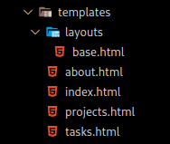
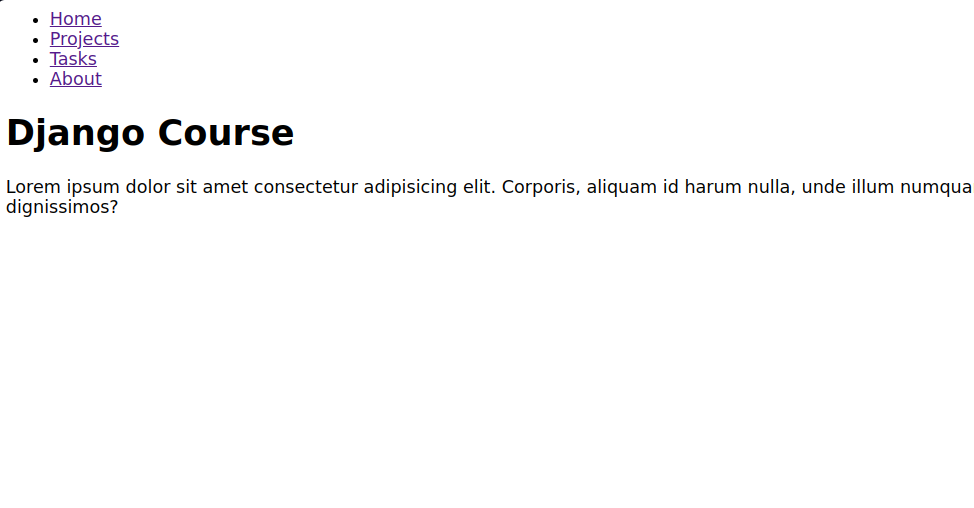

# Template inheritance

Template inheritance is a powerful feature in web templating engines like Jinja2 and Django templates. It
allows you to create a base or parent template that defines the common structure and layout of your web pages.
Child templates can then inherit from this base template and override or extend specific sections, enabling you
to create consistent and maintainable layouts across your web application.

We should create a folder called **layouts** inside templete's folder, where we create the template to do the
inheritance



In the base.html file defines the overall structure of a web page. It includes placeholders called "blocks"
****** where child templates can insert their content.

```html
<nav>
    <ul>
        <li>
            <a href="/">Home</a>
        </li>
        <li>
            <a href="/projects">Projects</a>
        </li>
        <li>
            <a href="/tasks">Tasks</a>
        </li>
        <li>
            <a href="/about">About</a>
        </li>
    </ul>
</nav>




```

Now in the templates html we can use the ****** tag to indicate that this template
inherits from base.html. You can then override specific blocks to provide content specific to this page.
In this case, the child template overrides the "content" block.

```html




<h1>{{title}}</h1>

<p>Lorem ipsum dolor sit amet consectetur adipisicing elit. Corporis, aliquam id harum nulla, unde illum numquam ab
    porro nihil odio dolore sunt totam nobis reprehenderit corrupti soluta ad veritatis dignissimos?
</p>


```

This on all template as you wish, in this case every template has a nav inherits from base.html



Template inheritance is a powerful tool for building maintainable and consistent web layouts. It allows you to
define the common structure of your pages in one place (the base template) and create variations for different
pages while keeping the layout and structure consistent across your site.
