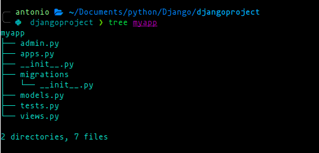

# App Structure

When you create a new Django app, several files are generated within the app directory. Each of these files serves a specific
purpose and plays a crucial role in defining the functionality of the app within the Django project.

## admin.py

This file is used for registering models with the Django Admin interface. The Django Admin is a powerful feature that
provides an easy-to-use interface for managing data in your application. By defining model admin classes in this file, you
can customize how your models are displayed and edited in the Django Admin.

## apps.py

This file contains the app configuration class. The configuration class helps Django recognize your app and provides metadata
about the app, such as its name, label, and more. It is also possible to override app-related methods in this file if needed.

## __init.py__

This is an empty file that tells Python that the directory is a Python package. It is required to treat the app as a module
and allows you to import code from other files within the app.

## migrations/

This directory contains database schema migration files. Migrations are used to manage changes in your models over time
without losing data. When you modify your models (e.g., add a new field or change a field type),
Django creates migration files in this directory, and you can apply these migrations to update your database schema.

## models.py

This is where you define the database models for your app. Django's Object-Relational Mapping (ORM) allows you to define
these models as Python classes, and Django will automatically create the corresponding database tables for you. Models
represent the structure of your data and are central to database operations.

## tests.py

This file is where you write tests for your app. Django encourages writing unit tests to ensure that your app's functionality
behaves as expected. Proper testing helps catch bugs early and provides confidence in the reliability of your codebase.

## views.py

Views are responsible for handling HTTP requests and returning responses. In this file, you define functions or classes
(called view functions or view classes) that handle different URL patterns and interact with your app's models to render
templates or return JSON responses.
