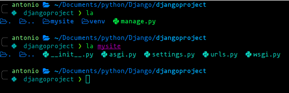
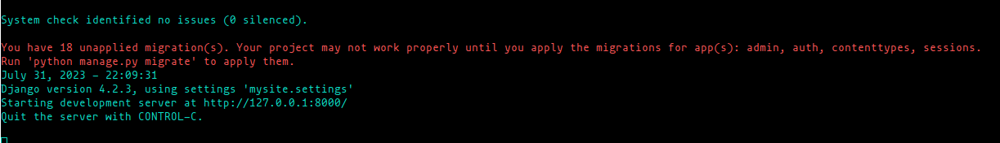
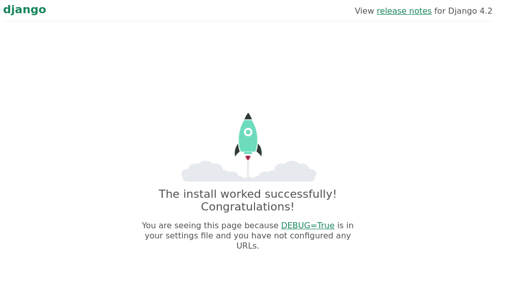

# Create Project in Django

## Command to create a project in Django

To create a project in Django, you need this, command:

    django-admin startproject <Project Name> <PATH(optional)>

    django-admin startproject myapp .

**Disclaimer**
It very importante the project's name not will be a keywords like python, django, test, etc.

When we already have our project created, a folder with the project's name and other python files should appear

## Files

The called file "manage.oy" serves as a central tool for managing various aspects of a Django project, making
it easier to interact with the framework and perform common tasks without having to remember complex commands or scripts.

In this project we used it to run the server.

### Run server

To run the server you must type this command:

    python manage.py runserver

The output must be the next:

At the time we run this command, django creates a "db.sqlite3" file as well, so when we click on the server address(link)
it will reload to the next page, this is the default server.

### If you want you can change the server's port, just add the port number to the end of the command
