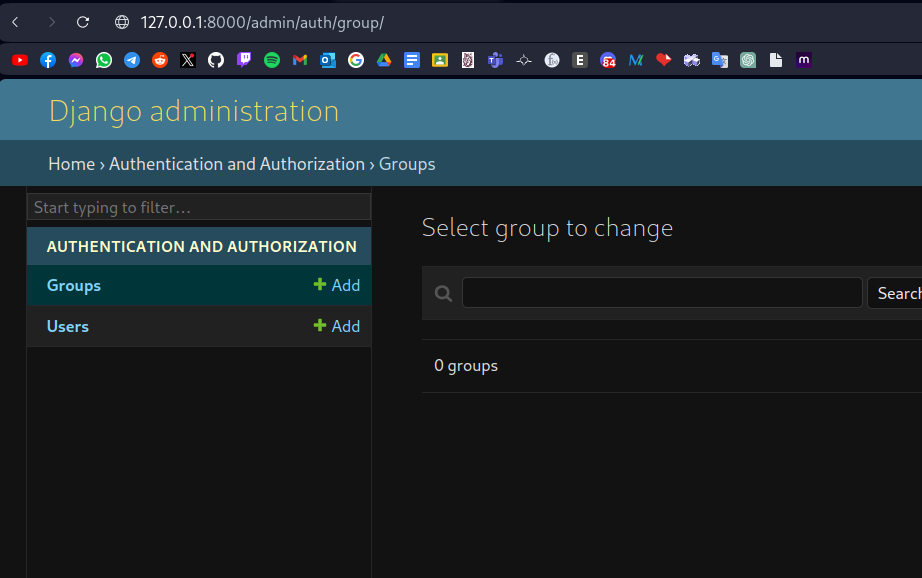

# Django Admin

Django Admin is a powerful and customizable web-based interface provided by Django for managing
the administrative tasks of a Django project. It's designed to make it easy for developers and administrators
to interact with the application's data and perform various administrative operations without having to write
custom administrative views.

## Steps to access

To create super user to have access to django admin you need run this command the first time


Now you can have access with the url admin/, and you should see this:


But our models not are included in the panel



To add our models in the file admin.py located in myapp folder you can import your models:

```py
from django.contrib import admin
from .models import Task, Project

# Register your models here.
admin.site.register(Project)
admin.site.register(Task)
```

And now you can see your models in the panel admin


And you can add, modify or delete something from your models
