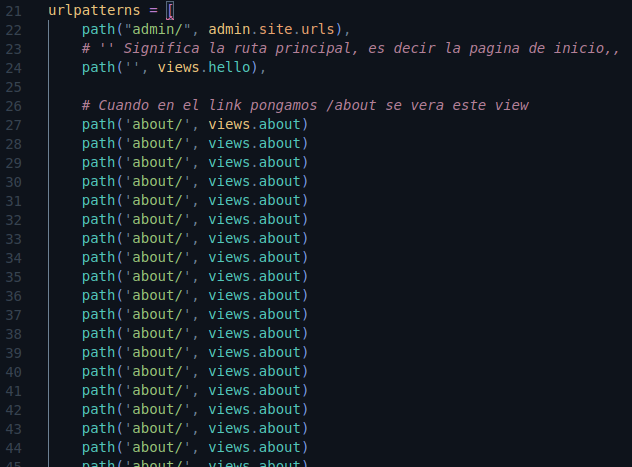

# Include

Sometimes we have too many urls, and that means that the urls file looks very cluttered like this:



So if we have appliactions(apps) why does not each app have it's own urls?
That means each app can have all its urls

## Steps

1. The first thing is to create a files called 'urls.py' on the app, in this case is inside the myapp folder
The next thing is to create a list called like the previous 'urls.py' file(patterns) and import the module
path and the view.py file, the final file its like the old urls.py file.

    

2. In the original urls.py file we need import the module **include**.

    ```py
    from django.urls import path, include
    ```

3. In the original urls.py file we need include the new **urls** file.

    ```py
    from django.contrib import admin
    from django.urls import path, include

    urlpatterns = [
        path("admin/", admin.site.urls),

        # '' Significa la ruta principal, es decir la pagina de inicio
        path('', include('myapp.urls'))
    ]
    ```
