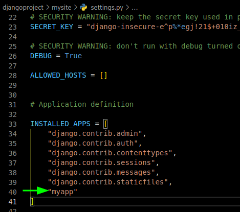

# Models and Data Base in Sqlite

When we excecuted our appliaction, with the commmad

```sh
python manage.py runserver
```

We can show the next message:


This is a notification provided by Django when there are database migrations that
have been created but haven't been applied to the database yet. This message indicates
that there are changes in your project's models that require updating the database
schema to reflect those changes.

## What is a **Database Migration**?

Database migrations in Django are used to manage changes to the structure of the database, such as adding, modifying, or removing tables and fields. Each time you make changes to your models, you typically create a migration that captures those changes, and then you apply the migrations to actually update the database.

## How to show a Sqlite Database?

To we can see a sqlite database, we would install a software called
**DB Browser for SQLite**, for arch linux you just type this command:

```sh
sudo pacman -S sqlitebrowser
```

At the moment to open your sqlite database, we can see how does not have any table or field, that is,
it is empty


### Make migrations

The first thing to do databese migrations is make it like this:

```sh
python manage.py makemigrations
```

This command scans your project for changes in the models and creates migration files that
capture these changes. Each migration file contains Python code that describes how to apply
or revert a specific database schema change.


### Apply migrations

Once you are satisfied with the generated migration files, you can apply the migrations to your
database using the migrate command

```sh
python manage.py migrate
```

This command executes the migrations in the order they were created and updates your database
schema to match your model changes.


Using makemigrations and migrate commands helps keep your database schema synchronized with your
codebase, allowing you to evolve your application's data structure over time while maintaining
data integrity.

#### Remember that whenever you modify your models, it's a good practice to run $makemigrations$  to generate the appropriate migration files and then run $migrate$ to apply those changes to the database

Now we can see the database have already tables and fields


## Models

In the myapp folder, the file called 'models.py' is where you define the database models for your app.
Django's Object-Relational Mapping (ORM) allows you to define these models as Python classes, and
Django will automatically create the corresponding database tables for you. Models represent the
structure of your data and are central to database operations.


In order for your Django project to recognize the model created, in the project file called
'setting.py' (in this case, inside the mysite folder) we need add the appliaction on the
'INSTALLED_APPS' list.



### makemigrations

Now that the database has changed, you need makemigrations


Now in the folder migrations inside of the myapp, we can see a new file has been created, this is a
reference to how was created the model on the database


### migrate

Now is necesarry apply this changed, to this:


Now we have a new table on the database


