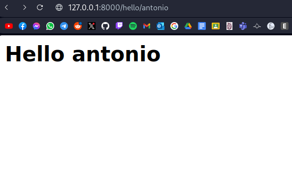

# Params

In Django, "params" typically refer to parameters that can be passed to a view or a URL
pattern in the context of handling HTTP requests. These parameters allow you to customize
the behavior of your views or perform specific actions based on user input.

## Example of Path parameters(URL capture)

Path parameters are parts of the URL that are captured and extracted by defining URL patterns
using angle brackets (< >) in your urls.py file. These captured values can then be passed as
arguments to your view functions. For example:

### views file

We have a function called hello that receive a username parameter, and then print this username
with the message "Hello"

``` py
def hello(request, username):
    return HttpResponse("<h2>Hello %s</h2>" %username)
```

### urls file

We have the url hello/username when username is any string, it's can be some data type(int, str, etc.)

```py
urlpatterns = [
    path('hello/<str:username>', views.hello),
]
```

### Web page

We pass in the URL the username "antonio", so the function in the views file concatenate a username with the hello message


