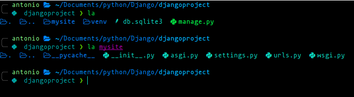
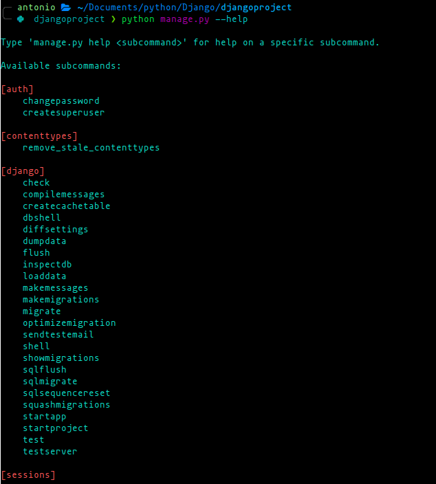
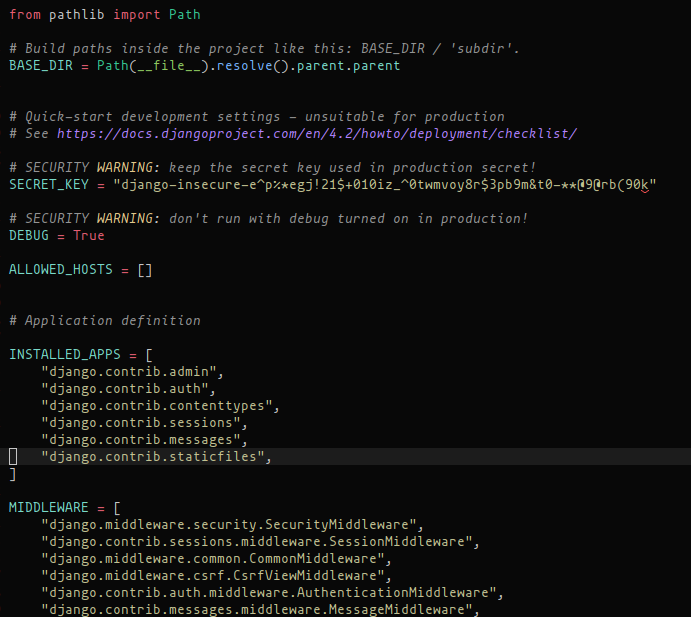
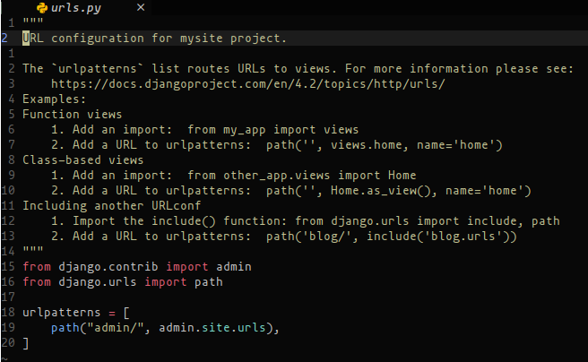

# Project Struture

In these notes, we learn about the following structure created by Django

## manage

The "manage.py" file is for management commands like the following:

In others words, it serves as a central tool for managing various aspects of a Django project, making
it easier to interact with the framework and perform common tasks without having to remember complex commands or scripts.

## __init__.py

This is an empty file that marks the directory as a Python package. It is essential for Python to recognize the project and
the apps within it as packages.

## settings.py

This file contains all the project's settings, including database configuration, installed apps, middleware, static and
media file settings, internationalization settings, time zone settings, and much more. You can customize various aspects
of your project by modifying the settings in this file.

## urls.py

This file contains the URL patterns for your project. It maps URL patterns to corresponding views or other URL patterns
defined in your apps. The URLs defined here determine the structure of your application's URLs.

## asgi.py and wsgi.py

These files are used for ASGI (Asynchronous Server Gateway Interface) and WSGI (Web Server Gateway Interface) respectively.
They are entry points for serving your Django project using asynchronous and traditional web servers.
