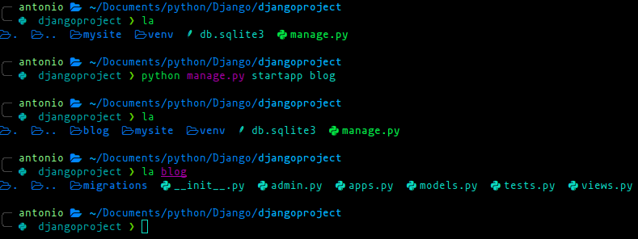

# Project and App in Django

In Django the terms **"project"** and **"app"** refer to different components of a web application,

## Project

A Django project is the top-level organizational unit that encompasses the entire web application.
It acts as a container for one or more Django apps, settings and configuration.
A project consist of multiple apps that work together to create a complete web application

## Application(App)

A Django app is a modular component of a Django project. It represents a specific funcionality or feature of the web application.
Apps are reusable and can be plugged into different projects or shared among different projects. For example, you might
have separate apps for user authentication, blog posts, or a forum.

## Commands

To create a Django app, you can type the following command:

    python manage.py startapp <App's name>

Each app has its own set of models, views, templates, and static files. It is organized as a directory within the project
directory structure.

## Include App to Project

In order for our Django project to recognize the recently created app, we need add the app's name to the
**settings.py** file

