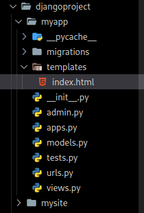

# Render

In Django, the render function is a commonly used utility for rendering HTML templates
and returning an HTTP response. It's often used within view functions to generate dynamic
web pages by combining data from the server with HTML templates.

The render function is part of Django's web framework and is typically imported from django.shortcuts.
It simplifies the process of rendering templates and sending the resulting HTML as a response to the
client's web browser.

```py
from django.shortcuts import render

def index(request):
    # ... view logic ...
    return render(request, 'template_name.html', context_dict)
```

* request: This is the HTTP request object that is automatically passed to your view function when it's called. It contains information about the client's request, such as GET and POST data, headers, and more.

* 'template_name.html': This is the path to the HTML template file you want to render. Django will search for this template within your project's template directories.

* context_dict: This is a dictionary containing data that you want to pass to the template. It can include variables, lists, or any other data that you want to use within the template to generate dynamic content.

The first thing is create a new directory inside myapp called **templates**, in that directory
we created our html



Here's the basic syntax of the render function:

```py
from django.shortcuts import render

def index(request):
    return render(request, "index.html")
```

Now your project URLs will go to the templates.
