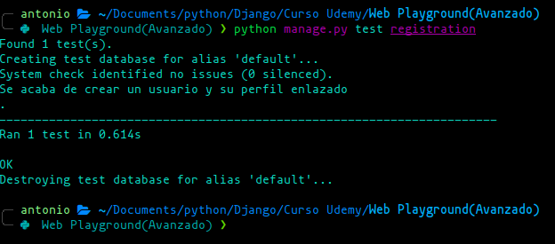

# Unit Test

In Django, you can perform unit tests to verify the proper functioning of your code, including your models, views, forms, and other components.
Django provides a set of built-in tools to make writing and running tests easier.

## Example

In test.py file we can add the next lines to test the Profile modelSupongamos que tienes un modelo simple en tu aplicación llamado Producto y quieres realizar pruebas unitarias para él.

```py
from django.test import TestCase
from .models import Profile
from django.contrib.auth.models import User

# Create your tests here.
# Creando una prueba unitaria
class ProfileTestCase(TestCase):
    # Metodo heredado de TestCase, es en donde tenemos que preparar la prueba
    def setUp(self) -> None:
        User.objects.create_user('test', 'test@test.com', 'test1234')

    # Metodo de la prueba, debe comenzar con "test_" seguido del nombre que se desee
    def test_Profile_Exists(self):
        exists = Profile.objects.filter(user__username='test').exists()

        # Comprobando si exists tiene el valor true
        self.assertEqual(exists, True)
```

## Run Test

To run the tests, use the following command in the terminal:

```sh
python manage.py test <app_name>
python manage.py test registration
```

Django will find and run all tests in the application.Django will find and run all tests in the application.


